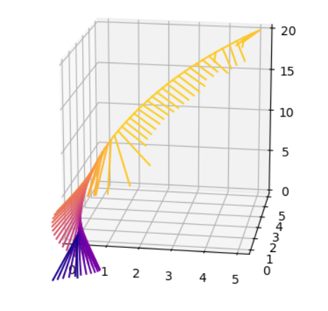
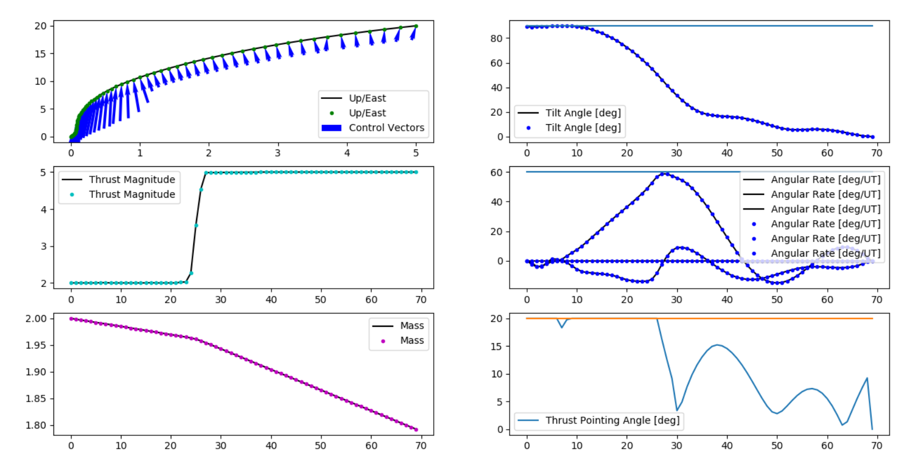

# TODO: Landing trajectory optimization in Kerbal Space Program
forked from https://github.com/jonnyhyman/SuccessiveConvexification

Done: rewrite solver in cvxpy 0.4.11 & support codegen

Todo: kRPC -> KSP

# Requirements
cvxpy                    0.4.11  
[cvxpy-codegen](https://github.com/moehle/cvxpy_codegen)            0.0.1  (Optional for codegen)  
scipy                   1.2.1  
numpy  
matplotlib (Optional for drawing result)  

# Run Test

solve using the example data
``` powershell
python .\SC_solver.py
```

see result
``` powershell
cd .\trajectory
python .\plot.py
```




call solver from your python project
```python
import SC_solver, SC_params

vessel = SC_params.VesselProfile.get_default()
state_initial = SC_params.VesselState.get_default_initial()
state_final =   SC_params.VesselState.get_default_final()

x, u, tf = SC_solver.solve(vessel, state_initial, state_final, use_c=False, verbose=False)
# where x is the state variable
# u is the control variable
# tf is time of flight

```

# Generated C Code

Run build.bat to generate & compile & install C code for the solver

Change use_c=True in SC_solver.solve function to use generated c code (might be faster)

You can also test generated code with the example data:
``` powershell
python .\SC_solver.py codegen
```

# Original Readme

[old/README.md](old/README.md)